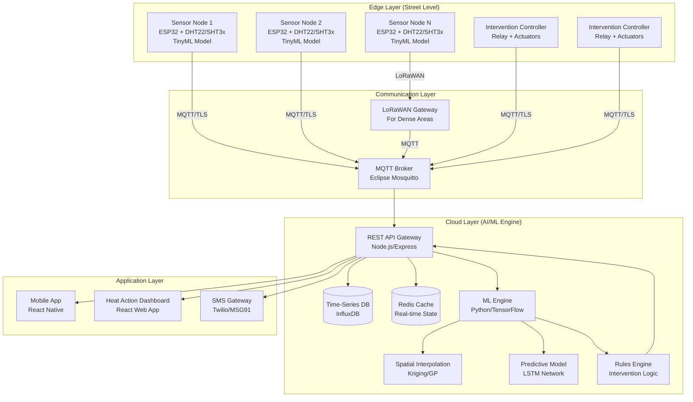

# Design Document: Amrit-Vayu (Urban Thermal Shield)

## Overview

Amrit-Vayu is a decentralized Cyber-Physical System (CPS) designed to combat urban heat islands in Indian cities through real-time monitoring, AI-driven prediction, and automated cooling interventions. The system combines low-cost IoT sensors, edge computing, machine learning, and physical actuation to protect vulnerable populations from extreme heat events.

The architecture follows a layered approach:
- **Edge Layer**: Distributed sensor nodes with local intelligence
- **Communication Layer**: Resilient MQTT/LoRaWAN networking
- **AI/ML Engine**: Predictive analytics and spatial interpolation
- **Actuation Layer**: Automated cooling interventions
- **Application Layer**: Mobile apps and web dashboards

This design prioritizes cost-effectiveness (₹2000 per sensor node), scalability (50 to 10,000 nodes), offline resilience, and real-time responsiveness to protect urban poor, street vendors, and other vulnerable citizens.

## Architecture

### System Architecture Diagram



### Layered Architecture Description

**Edge Layer (Hardware)**
- ESP32 microcontrollers serve as the compute platform for sensor nodes
- DHT22 sensors (±0.5°C accuracy) or SHT3x sensors (higher accuracy) measure temperature and humidity
- TinyML models run locally on ESP32 to filter sensor noise and detect "Heat Spikes"
- Local intelligence enables offline operation when internet connectivity drops
- GPS module (NEO-6M or similar) provides location data with 10m accuracy
- Solar panel + LiPo battery provides 30+ days of autonomous operation

**Communication Layer**
- MQTT (Message Queuing Telemetry Transport) protocol for lightweight, reliable messaging
- Eclipse Mosquitto as the central MQTT broker
- TLS 1.3 encryption for all data transmission
- LoRaWAN for dense areas (slums) where WiFi/cellular is unreliable
- Long-range (up to 10km), low-power connectivity
- Fallback mechanisms: nodes buffer data locally when disconnected

**AI/ML Engine**
- Spatial Interpolation: Kriging or Gaussian Processes estimate temperatures in streets without sensors
- Predictive Analytics: LSTM neural network forecasts local heatwaves 30-60 minutes ahead
- Input features: temperature, humidity, wind speed, time-of-day, historical trends
- Rules Engine: Triggers physical relays based on temperature thresholds and predictions
- Real-time processing: predictions updated every 30 minutes

**Actuation Layer**
- Intervention Controllers: ESP32-based relay boards connected to MQTT
- Misting Systems: Solenoid valves control water flow to misting nozzles
- Smart Awnings: Motorized shades over high-traffic pedestrian zones
- Local autonomy: controllers operate based on local sensors during network outages

**Application Layer**
- React Native mobile app for citizens
- "Cool Corridor" routing using Dijkstra's algorithm weighted by temperature
- React-based web dashboard for municipal heat-action teams
- SMS gateway for feature phone users without smartphones

## Components and Interfaces

### 1. Sensor Node (Edge Device)

**Hardware Components:**
- ESP32-WROOM-32 microcontroller (₹300)
- DHT22 temperature/humidity sensor (₹200) or SHT3x (₹400)
- NEO-6M GPS module (₹300)
- Solar panel 5W + 3.7V LiPo battery 5000mAh (₹600)
- Weatherproof enclosure IP65 rated (₹400)
- LoRa module RFM95W for dense deployments (₹400, optional)
- Total cost: ₹1800-₹2200 per unit

**Software Components:**
- FreeRTOS-based firmware
- TinyML model (TensorFlow Lite Micro) for noise filtering
- MQTT client library (PubSubClient)
- Local data buffer (circular buffer, 100 readings)
- Watchdog timer for automatic recovery

**Interfaces:**
- MQTT Topics:
  - Publish: `amrit-vayu/sensors/{node_id}/data` (temperature, humidity, GPS, timestamp)
  - Publish: `amrit-vayu/sensors/{node_id}/status` (battery, uptime, signal strength)
  - Subscribe: `amrit-vayu/sensors/{node_id}/config` (threshold updates, sampling rate)
  - Publish: `amrit-vayu/sensors/{node_id}/alert` (local heat spike detection)

**Data Format (JSON):**
```json
{
  "node_id": "SN-001",
  "timestamp": "2024-06-15T14:30:00Z",
  "temperature": 42.5,
  "humidity": 35.2,
  "gps": {"lat": 19.0760, "lon": 72.8777},
  "battery": 87,
  "signal_strength": -65
}
```

**TinyML Model:**
- Input: Last 10 temperature readings (sliding window)
- Output: Binary classification (normal/heat_spike)
- Model size: <50KB (fits in ESP32 flash)
- Inference time: <100ms
- Purpose: Filter sensor glitches, detect rapid temperature rises

### 2. MQTT Broker

**Implementation:**
- Eclipse Mosquitto (open-source)
- Deployed on cloud VM (AWS EC2 t3.medium or equivalent)
- TLS 1.3 with certificate-based authentication
- QoS levels: QoS 1 (at least once delivery) for sensor data
- Persistence enabled for message buffering during downtime

**Configuration:**
- Max connections: 10,000 (supports 10,000 sensor nodes)
- Message retention: 24 hours for critical topics
- Bridge configuration: connects multiple regional brokers if needed

**Topics Structure:**
```
amrit-vayu/
├── sensors/
│   ├── {node_id}/data
│   ├── {node_id}/status
│   ├── {node_id}/config
│   └── {node_id}/alert
├── interventions/
│   ├── {controller_id}/command
│   ├── {controller_id}/status
│   └── {controller_id}/feedback
└── system/
    ├── alerts
    ├── predictions
    └── health
```

### 3. LoRaWAN Gateway (For Dense Areas)

**Hardware:**
- RAK7258 WisGate Edge Lite or similar (₹15,000 per gateway)
- Coverage: 2-5km radius in urban areas
- Supports 1000+ nodes per gateway

**Integration:**
- LoRaWAN packets decoded and forwarded to MQTT broker
- Bidirectional communication for configuration updates
- Lower data rate (suitable for temperature readings every 60 seconds)

### 4. API Gateway

**Technology Stack:**
- Node.js with Express.js framework
- REST API + WebSocket for real-time updates
- JWT-based authentication for dashboard users
- Rate limiting: 1000 requests/minute per user

**Key Endpoints:**
```
POST   /api/v1/sensors/register          # Register new sensor node
GET    /api/v1/sensors/{node_id}/data    # Get sensor readings
GET    /api/v1/heatmap                   # Get interpolated temperature map
GET    /api/v1/predictions                # Get heat predictions
POST   /api/v1/routes/cool                # Calculate cool route
GET    /api/v1/interventions              # List all interventions
POST   /api/v1/interventions/{id}/activate # Manual intervention control
GET    /api/v1/alerts                     # Get active heat alerts
WebSocket /ws/realtime                    # Real-time data stream
```

**Data Flow:**
1. MQTT subscriber receives sensor data
2. Data validated and stored in InfluxDB
3. Redis cache updated with latest readings
4. ML engine triggered for predictions
5. Rules engine evaluates intervention triggers
6. WebSocket pushes updates to connected clients

### 5. Time-Series Database (InfluxDB)

**Schema:**
- Measurement: `temperature_readings`
  - Tags: node_id, location_zone, sensor_type
  - Fields: temperature, humidity, battery, signal_strength
  - Timestamp: nanosecond precision

- Measurement: `interventions`
  - Tags: controller_id, intervention_type, location_zone
  - Fields: status, activation_time, deactivation_time
  - Timestamp: nanosecond precision

**Retention Policies:**
- Raw data: 90 days (requirement 6.5)
- Downsampled (5-minute averages): 1 year
- Downsampled (1-hour averages): 5 years

**Queries:**
- Real-time: Last 5 minutes of data for heatmap
- Historical: Aggregated data for ML training
- Alerting: Continuous queries for threshold violations

### 6. Redis Cache

**Purpose:**
- Store latest sensor readings (TTL: 5 minutes)
- Cache interpolated temperature maps (TTL: 3 minutes)
- Store active heat alerts and predictions
- Session management for dashboard users

**Data Structures:**
```
Key: sensor:{node_id}:latest
Value: JSON (temperature, humidity, timestamp)

Key: heatmap:latest
Value: JSON (grid of interpolated temperatures)

Key: alerts:active
Value: Set of alert IDs

Key: prediction:{zone_id}
Value: JSON (forecasted temperatures, confidence)
```

### 7. ML Engine (Spatial Interpolation)

**Technology:**
- Python with scikit-learn, PyKrige libraries
- Deployed as microservice (Docker container)
- Triggered every 3 minutes or on-demand

**Kriging Implementation:**
- Ordinary Kriging for spatial interpolation
- Input: Sensor locations (lat, lon) + temperature readings
- Output: Temperature estimates for 100m x 100m grid cells
- Variogram model: Spherical or Gaussian (fitted from data)

**Gaussian Process Alternative:**
- For areas with sparse sensors
- Provides uncertainty estimates (confidence intervals)
- Kernel: RBF (Radial Basis Function) with length scale tuning

**Process:**
1. Fetch latest sensor readings from Redis
2. Filter outliers (Z-score > 3)
3. Fit Kriging/GP model
4. Generate temperature grid for city area
5. Store interpolated map in Redis
6. Identify hotspots (areas > Heat_Threshold)

### 8. ML Engine (Predictive Analytics - LSTM)

**Model Architecture:**
- LSTM network with 2 hidden layers (64 units each)
- Input sequence: Last 12 hours of data (24 timesteps at 30-min intervals)
- Features per timestep: temperature, humidity, wind speed, time-of-day (one-hot), day-of-week (one-hot)
- Output: Temperature forecast for next 6 hours (12 timesteps)

**Training:**
- Historical data: 1 year of sensor readings
- External data: IMD weather forecasts, satellite data
- Loss function: Mean Absolute Error (MAE)
- Target: MAE < 2°C (requirement 3.1)
- Retraining: Weekly with new data

**Inference:**
- Runs every 30 minutes (requirement 3.4)
- Separate model per neighborhood zone (micro-climate patterns, requirement 3.5)
- Prediction horizon: 6 hours ahead
- Early warning: Alert if predicted temperature > Heat_Threshold within 2 hours (requirement 3.2)

**Implementation:**
- TensorFlow/Keras for model development
- TensorFlow Serving for production inference
- Model versioning and A/B testing support

### 9. Rules Engine (Intervention Logic)

**Technology:**
- Python-based rule evaluation engine
- Triggered by: new sensor data, predictions, manual commands

**Rule Types:**

**Rule 1: Immediate Heat Response**
```python
IF current_temperature > Heat_Threshold
   AND humidity < 85%
   AND intervention_available(location)
   AND NOT intervention_active(location)
THEN activate_intervention(location, type="misting")
     log_activation(location, timestamp, reason="threshold_exceeded")
```

**Rule 2: Predictive Activation**
```python
IF predicted_temperature(+2_hours) > Heat_Threshold
   AND confidence > 0.8
   AND intervention_available(location)
THEN send_alert(administrators, "predictive_heat_event")
     prepare_intervention(location)  # Pre-stage but don't activate
```

**Rule 3: Deactivation**
```python
IF current_temperature < (Heat_Threshold - 2°C)
   AND duration_below_threshold > 10_minutes
   AND intervention_active(location)
THEN deactivate_intervention(location)
     log_deactivation(location, timestamp)
```

**Rule 4: Humidity Override**
```python
IF humidity > 85%
   AND intervention_type == "misting"
THEN deactivate_intervention(location)
     log_deactivation(location, reason="high_humidity")
```

**Rule 5: Manual Override**
```python
IF manual_command(administrator, action, location)
   AND administrator.has_permission("intervention_control")
THEN execute_command(action, location)
     log_action(administrator, action, location, timestamp)
```

**Execution:**
- Rules evaluated every 30 seconds
- Priority queue for conflicting rules
- Audit log for all rule executions (requirement 8.7)

### 10. Intervention Controller

**Hardware:**
- ESP32 microcontroller
- 4-channel relay board (controls up to 4 actuators)
- 12V power supply
- Solenoid valves (for misting systems)
- Motor drivers (for smart awnings)

**Software:**
- MQTT client for command reception
- Local temperature sensor for offline operation
- State machine: IDLE → ARMED → ACTIVE → COOLDOWN → IDLE
- Watchdog timer and failsafe mechanisms

**Interfaces:**
- MQTT Topics:
  - Subscribe: `amrit-vayu/interventions/{controller_id}/command`
  - Publish: `amrit-vayu/interventions/{controller_id}/status`
  - Publish: `amrit-vayu/interventions/{controller_id}/feedback`

**Command Format:**
```json
{
  "controller_id": "IC-001",
  "action": "activate",
  "intervention_type": "misting",
  "duration": 600,
  "timestamp": "2024-06-15T14:30:00Z"
}
```

**Status Format:**
```json
{
  "controller_id": "IC-001",
  "state": "active",
  "intervention_type": "misting",
  "local_temperature": 41.2,
  "uptime": 86400,
  "last_activation": "2024-06-15T14:30:00Z"
}
```

**Offline Operation:**
- If disconnected from MQTT for > 5 minutes, switch to local mode
- Use local temperature sensor + last known Heat_Threshold
- Activate intervention if local_temperature > Heat_Threshold
- Buffer commands and status updates for transmission when reconnected
- Operate for 4+ hours on last configuration (requirement 9.1)

### 11. Mobile App (React Native)

**Features:**
- Cool Route navigation
- Real-time temperature map
- Heat alerts and notifications
- Multi-language support (7 languages, requirement 10)
- Voice navigation instructions

**Cool Route Algorithm (Dijkstra's Weighted):**
```python
def calculate_cool_route(start, end, temperature_map):
    # Build graph: nodes = street intersections, edges = street segments
    graph = build_street_graph(city_map)
    
    # Weight edges by temperature
    for edge in graph.edges:
        base_distance = edge.length_meters
        avg_temperature = get_temperature(edge, temperature_map)
        shade_factor = get_shade_coverage(edge)  # 0.0 to 1.0
        cooling_factor = has_active_intervention(edge)  # 0.0 or 0.5
        
        # Weight formula: prioritize cooler streets
        temperature_penalty = (avg_temperature - 25) * 10  # 25°C baseline
        shade_bonus = -shade_factor * 50
        cooling_bonus = -cooling_factor * 100
        
        edge.weight = base_distance + temperature_penalty + shade_bonus + cooling_bonus
    
    # Run Dijkstra's algorithm
    path = dijkstra(graph, start, end)
    
    # Calculate route metrics
    total_distance = sum(edge.length_meters for edge in path)
    avg_temperature = mean(get_temperature(edge, temperature_map) for edge in path)
    walking_time = total_distance / 1.4  # 1.4 m/s average walking speed
    
    # Identify rest points (cooling facilities)
    rest_points = find_cooling_facilities_along_route(path)
    
    return {
        "path": path,
        "distance": total_distance,
        "avg_temperature": avg_temperature,
        "walking_time": walking_time,
        "rest_points": rest_points
    }
```

**Temperature Map Update:**
- Fetch interpolated temperature grid every 3 minutes
- Display as heatmap overlay on street map
- Color coding: Green (<35°C), Yellow (35-40°C), Orange (40-45°C), Red (>45°C)

**Notifications:**
- Push notifications for heat alerts in user's area
- Geofencing: alert when entering high-temperature zone
- Background location updates (with user consent)

**Multi-Language Support:**
- i18n library (react-i18next)
- Language files for Hindi, English, Tamil, Telugu, Bengali, Marathi, Gujarati
- Text-to-speech for voice navigation (Android TTS, iOS AVSpeechSynthesizer)

**Privacy:**
- Location data anonymized to 100m grid cells before transmission (requirement 8.2)
- No user identity stored with route requests (requirement 8.5)
- Local storage only for user preferences

### 12. Heat Action Dashboard (React Web App)

**Features:**
- Real-time city-wide temperature map
- Heat event visualization with severity indicators
- Intervention status monitoring
- Predictive alerts display
- Historical data analysis
- Manual intervention controls
- System health monitoring
- Daily heat reports

**Technology Stack:**
- React with TypeScript
- Mapbox GL JS for interactive maps
- Chart.js for data visualization
- WebSocket for real-time updates
- Material-UI for components

**Dashboard Sections:**

**1. Live Map View:**
- Heatmap overlay showing interpolated temperatures
- Sensor node markers (color-coded by temperature)
- Intervention controller markers (status indicators)
- Heat event boundaries (polygons)
- Click on sensor/controller for detailed info

**2. Alerts Panel:**
- Active heat alerts (sorted by severity)
- Predictive alerts (forecasted events)
- System alerts (offline sensors, failed controllers)
- Alert details: location, temperature, affected population estimate

**3. Interventions Panel:**
- List of all intervention controllers
- Status: idle, active, offline, faulty
- Manual control buttons (activate/deactivate)
- Activation history and logs

**4. Analytics View:**
- Historical temperature trends (line charts)
- Heat event frequency (bar charts)
- Intervention effectiveness analysis
- Sensor uptime statistics
- Network connectivity metrics

**5. Reports:**
- Daily heat report generation (requirement 6.8)
- Summary: heat events, interventions, affected areas
- Export as PDF or CSV
- Scheduled email delivery to administrators

**Role-Based Access Control (RBAC):**
- Admin: Full access, manual intervention control
- Coordinator: View all data, generate reports
- Viewer: Read-only access to maps and alerts
- JWT tokens with role claims (requirement 8.4)

### 13. SMS Gateway

**Implementation:**
- Twilio or MSG91 API integration
- Supports Unicode for multi-language messages (requirement 10.4)

**Use Cases:**

**1. Heat Alerts:**
```
[Amrit-Vayu] गर्मी चेतावनी! आपके क्षेत्र में तापमान 43°C है। 
ठंडे मार्ग के लिए 1800-XXX-XXXX पर कॉल करें।
```

**2. Cool Route Requests:**
- User sends SMS: "ROUTE <start_location> TO <end_location>"
- System responds with simplified route instructions
```
ठंडा मार्ग: मेन रोड → पार्क स्ट्रीट → मार्केट रोड (2.3 km, 35°C औसत)
```

**3. Intervention Notifications:**
```
[Amrit-Vayu] मार्केट स्ट्रीट पर मिस्टिंग सिस्टम सक्रिय है। 
ठंडक के लिए वहां रुकें।
```

**Rate Limiting:**
- Max 10 SMS per user per day (prevent abuse)
- Priority queue for critical heat alerts

## Data Models

### Sensor Reading
```typescript
interface SensorReading {
  node_id: string;           // Unique sensor identifier
  timestamp: Date;           // ISO 8601 format
  temperature: number;       // Celsius, ±0.5°C accuracy
  humidity: number;          // Percentage, ±5% accuracy
  gps: {
    latitude: number;        // Decimal degrees
    longitude: number;       // Decimal degrees
    accuracy: number;        // Meters
  };
  battery: number;           // Percentage (0-100)
  signal_strength: number;   // dBm
  heat_spike: boolean;       // TinyML detection result
}
```

### Heat Event
```typescript
interface HeatEvent {
  event_id: string;          // UUID
  start_time: Date;
  end_time: Date | null;     // null if ongoing
  severity: 'low' | 'medium' | 'high' | 'extreme';
  affected_area: {
    type: 'Polygon';
    coordinates: number[][][]; // GeoJSON polygon
  };
  peak_temperature: number;
  affected_sensors: string[]; // Array of node_ids
  estimated_population: number; // People in affected area
  interventions_triggered: string[]; // Array of controller_ids
}
```

### Intervention Controller
```typescript
interface InterventionController {
  controller_id: string;
  location: {
    latitude: number;
    longitude: number;
  };
  intervention_type: 'misting' | 'awning' | 'spray';
  status: 'idle' | 'active' | 'offline' | 'faulty';
  last_activation: Date | null;
  total_activations: number;
  configuration: {
    heat_threshold: number;   // Celsius
    max_duration: number;     // Seconds
    cooldown_period: number;  // Seconds
  };
}
```

### Temperature Prediction
```typescript
interface TemperaturePrediction {
  prediction_id: string;
  zone_id: string;           // Neighborhood identifier
  generated_at: Date;
  forecast_horizon: number;  // Hours (typically 6)
  predictions: Array<{
    timestamp: Date;
    temperature: number;      // Predicted temperature
    confidence: number;       // 0.0 to 1.0
  }>;
  heat_event_probability: number; // 0.0 to 1.0
  alert_generated: boolean;
}
```

### Cool Route
```typescript
interface CoolRoute {
  route_id: string;
  start: {
    latitude: number;
    longitude: number;
  };
  end: {
    latitude: number;
    longitude: number;
  };
  path: Array<{
    latitude: number;
    longitude: number;
  }>;
  distance: number;          // Meters
  estimated_time: number;    // Seconds
  avg_temperature: number;   // Celsius
  max_temperature: number;   // Celsius along route
  rest_points: Array<{
    latitude: number;
    longitude: number;
    facility_type: string;   // 'water', 'shade', 'cooling_center'
  }>;
  temperature_profile: number[]; // Temperature at each path segment
}
```

### User (Dashboard)
```typescript
interface User {
  user_id: string;
  username: string;
  email: string;
  role: 'admin' | 'coordinator' | 'viewer';
  organization: string;
  language_preference: 'hi' | 'en' | 'ta' | 'te' | 'bn' | 'mr' | 'gu';
  created_at: Date;
  last_login: Date;
}
```

### System Configuration
```typescript
interface SystemConfiguration {
  config_id: string;
  heat_threshold_default: number;  // Celsius (35-50°C range)
  prediction_update_interval: number; // Minutes (default: 30)
  sensor_offline_timeout: number;  // Minutes (default: 5)
  intervention_deactivation_delta: number; // Celsius (default: 2)
  intervention_deactivation_duration: number; // Minutes (default: 10)
  humidity_threshold: number;      // Percentage (default: 85)
  max_intervention_duration: number; // Minutes
  alert_notification_channels: string[]; // ['sms', 'email', 'push']
}
```

### Audit Log
```typescript
interface AuditLog {
  log_id: string;
  timestamp: Date;
  user_id: string | null;    // null for automated actions
  action: string;            // 'intervention_activate', 'config_update', etc.
  resource_type: string;     // 'intervention', 'sensor', 'configuration'
  resource_id: string;
  details: Record<string, any>; // Action-specific details
  ip_address: string | null;
}
```


## Correctness Properties

A property is a characteristic or behavior that should hold true across all valid executions of a system—essentially, a formal statement about what the system should do. Properties serve as the bridge between human-readable specifications and machine-verifiable correctness guarantees.

The following properties are derived from the acceptance criteria in the requirements document. Each property is universally quantified (applies to all valid inputs) and should be validated through property-based testing during implementation.

### Property 1: Sensor Data Transmission Timeliness

*For any* sensor reading collected by a Sensor_Node, the transmission to the central system should complete within 60 seconds of measurement timestamp.

**Validates: Requirements 1.3**

**Testing Approach:** Generate random sensor readings with timestamps, simulate transmission, verify elapsed time < 60 seconds.

### Property 2: Offline Node Detection

*For any* Sensor_Node that stops transmitting data, the system should flag it as offline and generate an administrator alert within 5 minutes of the last received message.

**Validates: Requirements 1.5**

**Testing Approach:** Simulate sensor nodes going offline at random times, verify detection and alert generation within time limit.

### Property 3: Heat Alert Generation Speed

*For any* sensor reading where temperature exceeds the configured Heat_Threshold, the system should generate a heat alert within 30 seconds.

**Validates: Requirements 2.1**

**Testing Approach:** Generate random temperature readings above threshold, measure time from reading receipt to alert generation.

### Property 4: Heat Threshold Configuration Validation

*For any* threshold value between 35°C and 50°C (inclusive), the system should accept the configuration; for any value outside this range, the system should reject it with an error.

**Validates: Requirements 2.2**

**Testing Approach:** Generate random threshold values both inside and outside the valid range, verify acceptance/rejection behavior.

### Property 5: Geographic Analysis Timeliness

*For any* detected Heat_Event, the system should complete identification of all affected geographic areas within 2 minutes of event detection.

**Validates: Requirements 2.3**

**Testing Approach:** Generate heat events with varying numbers of affected sensors, measure geographic analysis completion time.

### Property 6: Multi-Channel Alert Delivery

*For any* heat alert generated, the system should send notifications to all registered administrators via all configured channels (SMS, email, dashboard).

**Validates: Requirements 2.4**

**Testing Approach:** Generate random heat alerts, verify notification delivery to all channels for all registered administrators.

### Property 7: Heat Event Aggregation

*For any* set of Sensor_Nodes within proximity threshold (e.g., 500m) that simultaneously report temperatures above Heat_Threshold, the system should create a single Heat_Event rather than multiple separate events.

**Validates: Requirements 2.5**

**Testing Approach:** Generate clusters of nearby sensors with high temperatures, verify single event creation with all sensors included.

### Property 8: Heat Event Severity Classification

*For any* Heat_Event with given peak temperature and duration, the system should assign the correct severity level according to classification rules (e.g., extreme: >45°C for >2 hours, high: 42-45°C for >1 hour, medium: 40-42°C for >30 min, low: 38-40°C).

**Validates: Requirements 2.6**

**Testing Approach:** Generate heat events with random temperature and duration combinations, verify correct severity assignment.

### Property 9: Predictive Alert Timing

*For any* temperature prediction that forecasts a Heat_Event, if the predicted event is at least 2 hours in the future, the system should generate a predictive alert immediately.

**Validates: Requirements 3.2**

**Testing Approach:** Generate predictions with heat events at various time horizons, verify alerts generated only for events ≥2 hours away.

### Property 10: Prediction Update Frequency

*For any* 30-minute time window, the system should generate updated temperature predictions at least once, incorporating the latest sensor data.

**Validates: Requirements 3.4**

**Testing Approach:** Monitor prediction generation over time, verify updates occur at correct intervals.

### Property 11: Intervention Activation Speed

*For any* Heat_Event detected in an area with installed Cooling_Intervention infrastructure, the system should trigger the appropriate intervention within 2 minutes of event detection.

**Validates: Requirements 4.1**

**Testing Approach:** Generate heat events in areas with interventions, measure time from detection to activation command.

### Property 12: Intervention Activation Logging

*For any* Cooling_Intervention activation, the system should create a log entry containing activation time, location (GPS coordinates), and intervention type.

**Validates: Requirements 4.3**

**Testing Approach:** Activate interventions with random parameters, verify log entries contain all required fields.

### Property 13: Intervention Deactivation Logic

*For any* active Cooling_Intervention, when the local temperature drops below (Heat_Threshold - 2°C) and remains below for at least 10 consecutive minutes, the system should deactivate the intervention.

**Validates: Requirements 4.4**

**Testing Approach:** Simulate active interventions with temperature dropping below threshold, verify deactivation timing.

### Property 14: Humidity-Based Intervention Prevention

*For any* intervention activation request when relative humidity exceeds 85%, the system should prevent activation (or deactivate if already active) for misting-type interventions.

**Validates: Requirements 4.5**

**Testing Approach:** Generate activation requests with random humidity values, verify misting interventions blocked when humidity > 85%.

### Property 15: Controller Failure Detection

*For any* Intervention_Controller that fails to respond to a command within a timeout period (e.g., 30 seconds), the system should mark the controller as faulty and generate an administrator alert.

**Validates: Requirements 4.6**

**Testing Approach:** Simulate controllers that don't respond to commands, verify failure detection and alerting.

### Property 16: Manual Intervention Override

*For any* manual intervention command from an authorized administrator, the system should execute the command regardless of automatic rules, and create an audit log entry.

**Validates: Requirements 4.7**

**Testing Approach:** Generate manual commands that conflict with automatic rules, verify execution and audit logging.

### Property 17: Cool Route Temperature Optimization

*For any* pair of start and end locations, the calculated Cool_Route should have an average temperature that is less than or equal to the shortest-path route's average temperature (or if no cooler route exists, should be the shortest path with a heat warning).

**Validates: Requirements 5.1, 5.2**

**Testing Approach:** Generate random location pairs with temperature maps, verify cool routes have lower or equal average temperature compared to shortest path.

### Property 18: Cool Route Multi-Channel Delivery

*For any* calculated Cool_Route, the system should provide properly formatted responses for both mobile app (JSON with full path details) and SMS (simplified text instructions) channels.

**Validates: Requirements 5.3**

**Testing Approach:** Generate random routes, verify response formatting for both channels.

### Property 19: Cool Route Cache Invalidation

*For any* change in temperature data, all cached Cool_Route recommendations should be invalidated and recalculated within 3 minutes of the temperature update.

**Validates: Requirements 5.4**

**Testing Approach:** Update temperature data, verify cached routes are invalidated and recalculated within time limit.

### Property 20: Cool Route Metadata Completeness

*For any* calculated Cool_Route, the response should include estimated average temperature, maximum temperature along route, walking time, and distance.

**Validates: Requirements 5.5**

**Testing Approach:** Generate random routes, verify all required metadata fields are present and correctly calculated.

### Property 21: Cool Route Rest Point Identification

*For any* Cool_Route that passes within a proximity threshold (e.g., 100m) of a registered cooling facility, the route response should include that facility as a rest point.

**Validates: Requirements 5.6**

**Testing Approach:** Generate routes with known cooling facilities nearby, verify rest points are identified and included.

### Property 22: Cool Route Fallback Behavior

*For any* route request where all possible routes have similar average temperatures (within 1°C), the system should return the shortest route and include a heat warning in the response.

**Validates: Requirements 5.7**

**Testing Approach:** Generate route requests in uniformly hot areas, verify shortest route selection and warning inclusion.

### Property 23: Dashboard Data Completeness

*For any* Heat_Action_Dashboard view request, the response should include real-time data from all active Sensor_Nodes, all Heat_Events with correct color-coded severity, status of all Intervention_Controllers, and all active predictive alerts.

**Validates: Requirements 6.1, 6.2, 6.3, 6.4**

**Testing Approach:** Generate dashboard requests with varying system states, verify all required data elements are present.

### Property 24: Historical Data Availability

*For any* date within the past 90 days, the system should return historical temperature data when queried from the Heat_Action_Dashboard.

**Validates: Requirements 6.5**

**Testing Approach:** Query historical data for random dates within 90-day window, verify data is returned.

### Property 25: Manual Dashboard Control Execution

*For any* manual intervention control command from the Heat_Action_Dashboard by an authorized administrator, the system should execute the command and update the intervention status.

**Validates: Requirements 6.6**

**Testing Approach:** Generate manual control commands, verify execution and status updates.

### Property 26: System Health Metrics Display

*For any* Heat_Action_Dashboard view, the system health section should display current sensor uptime percentages and network connectivity status for all nodes.

**Validates: Requirements 6.7**

**Testing Approach:** Request dashboard with various system health states, verify metrics are calculated and displayed correctly.

### Property 27: Daily Heat Report Generation

*For any* completed day (00:00 to 23:59), the system should generate a daily heat report containing summaries of all Heat_Events, Cooling_Interventions activated, and affected geographic areas.

**Validates: Requirements 6.8**

**Testing Approach:** Generate system data for random days, verify reports contain all required sections.

### Property 28: Low-Bandwidth Message Size

*For any* MQTT message transmitted by Sensor_Nodes or Intervention_Controllers, the payload size should not exceed 512 bytes to minimize bandwidth usage.

**Validates: Requirements 7.4**

**Testing Approach:** Generate various message types, verify payload sizes are within limit.

### Property 29: Sensor Auto-Discovery

*For any* new Sensor_Node that connects to the MQTT broker with a valid certificate, the system should automatically register it, assign configuration, and add it to the active nodes list without manual intervention.

**Validates: Requirements 7.5**

**Testing Approach:** Simulate new sensors connecting, verify automatic registration and configuration.

### Property 30: TLS Encryption Enforcement

*For any* connection attempt from a Sensor_Node or Intervention_Controller, the system should reject connections that do not use TLS 1.3 or higher encryption.

**Validates: Requirements 8.1**

**Testing Approach:** Attempt connections with various TLS versions and unencrypted connections, verify only TLS 1.3+ are accepted.

### Property 31: Location Data Anonymization

*For any* user location coordinate in a Cool_Route request, the system should round it to the nearest 100-meter grid cell before processing or storage.

**Validates: Requirements 8.2**

**Testing Approach:** Generate random precise coordinates, verify they are rounded to 100m grid cells.

### Property 32: PII Storage Prevention

*For any* data record stored in the system, if it contains personally identifiable information (email, phone, name), it should only be stored if an associated consent flag is set to true.

**Validates: Requirements 8.3**

**Testing Approach:** Attempt to store records with PII and varying consent flags, verify storage only occurs with consent.

### Property 33: Role-Based Access Control

*For any* user attempting to access a Heat_Action_Dashboard resource, the system should allow access only if the user's role has the required permission for that resource.

**Validates: Requirements 8.4**

**Testing Approach:** Generate access attempts with various user roles and resources, verify correct allow/deny decisions.

### Property 34: Anonymous Route Request Processing

*For any* Cool_Route request, the system should process and respond without creating any database record that links the request to a user identity or session ID.

**Validates: Requirements 8.5**

**Testing Approach:** Submit route requests, verify no user-linked records are created in database.

### Property 35: Administrative Action Audit Logging

*For any* administrative action (configuration change, manual intervention control, user management), the system should create an audit log entry containing user ID, action type, timestamp, resource affected, and action details.

**Validates: Requirements 8.7**

**Testing Approach:** Perform various administrative actions, verify audit log entries contain all required fields.

### Property 36: Offline Controller Autonomy

*For any* Intervention_Controller that loses network connectivity, it should continue operating autonomously based on local temperature sensor readings and last received configuration for at least 4 hours.

**Validates: Requirements 9.1, 9.4**

**Testing Approach:** Simulate network disconnection, verify controller continues making activation decisions based on local sensors.

### Property 37: Sensor Data Buffering

*For any* Sensor_Node unable to transmit data, it should buffer measurements locally up to a maximum of 100 readings, discarding oldest readings if buffer is full.

**Validates: Requirements 9.2**

**Testing Approach:** Simulate transmission failures, verify buffer stores up to 100 readings with FIFO behavior.

### Property 38: Buffered Data Synchronization

*For any* Sensor_Node that reconnects after being offline, it should transmit all buffered measurements to the central system in chronological order.

**Validates: Requirements 9.3**

**Testing Approach:** Simulate offline period with buffered data, verify all readings are transmitted upon reconnection.

### Property 39: Network Outage Detection

*For any* network outage affecting Sensor_Nodes or Intervention_Controllers, the system should detect the outage and generate an administrator alert within 5 minutes of connectivity loss.

**Validates: Requirements 9.5**

**Testing Approach:** Simulate network failures, verify detection and alerting within time limit.

### Property 40: Multi-Language Content Consistency

*For any* user interface text, alert message, or navigation instruction, when a user selects a supported language (Hindi, English, Tamil, Telugu, Bengali, Marathi, Gujarati), the system should render all content in that language across all channels (mobile app, SMS, voice).

**Validates: Requirements 10.2, 10.3, 10.4**

**Testing Approach:** Generate content in each supported language, verify consistent language across all delivery channels.


## Error Handling

### Sensor Node Errors

**1. Sensor Reading Failures**
- **Error:** DHT22/SHT3x sensor returns invalid reading (NaN, out of range)
- **Handling:** 
  - Retry reading up to 3 times with 1-second delay
  - If all retries fail, log error locally and skip transmission
  - If failures persist for >10 minutes, send diagnostic alert to central system
  - TinyML model should flag suspicious readings for filtering

**2. GPS Lock Failure**
- **Error:** GPS module cannot acquire satellite lock
- **Handling:**
  - Use last known good GPS coordinates (cached in flash memory)
  - Set GPS accuracy field to -1 to indicate stale data
  - Continue attempting GPS lock in background
  - Alert administrators if GPS fails for >24 hours

**3. Network Transmission Failures**
- **Error:** MQTT publish fails (network unavailable, broker unreachable)
- **Handling:**
  - Buffer reading locally (circular buffer, 100 readings max)
  - Retry transmission with exponential backoff (1s, 2s, 4s, 8s, max 60s)
  - If buffer full, discard oldest readings (FIFO)
  - When connection restored, transmit buffered data in chronological order

**4. Low Battery**
- **Error:** Battery level drops below 20%
- **Handling:**
  - Send low battery alert to central system
  - Reduce sampling frequency (e.g., from 60s to 120s)
  - Disable GPS to conserve power (use cached location)
  - At <10%, enter deep sleep mode (wake every 10 minutes for critical readings)

**5. TinyML Model Errors**
- **Error:** Model inference fails or produces invalid output
- **Handling:**
  - Fall back to simple threshold-based spike detection
  - Log error and continue operation
  - Send diagnostic data to central system for model debugging

### Communication Layer Errors

**1. MQTT Broker Unavailable**
- **Error:** Broker crashes or becomes unreachable
- **Handling:**
  - Sensor nodes buffer data locally (as above)
  - API Gateway queues outbound commands in Redis
  - Automatic broker restart via systemd or container orchestration
  - Alert administrators immediately
  - Failover to backup broker if configured

**2. TLS Certificate Expiration**
- **Error:** Node or broker certificate expires
- **Handling:**
  - Automated certificate renewal via Let's Encrypt or cert-manager
  - Warning alerts 30 days before expiration
  - Reject connections with expired certificates (security requirement)
  - Provide manual certificate update mechanism for nodes

**3. Message Queue Overflow**
- **Error:** Broker message queue exceeds capacity
- **Handling:**
  - Enable message persistence to disk
  - Implement QoS 1 (at least once delivery) for critical messages
  - Drop low-priority messages (e.g., status updates) if queue full
  - Alert administrators when queue >80% capacity

### AI/ML Engine Errors

**1. Kriging/GP Model Fitting Failure**
- **Error:** Insufficient sensor data or numerical instability in model fitting
- **Handling:**
  - Require minimum 5 active sensors for interpolation
  - If fitting fails, fall back to inverse distance weighting (IDW)
  - Use last successful interpolation result (cached, max age 10 minutes)
  - Log error and alert ML team for investigation

**2. LSTM Prediction Errors**
- **Error:** Model produces invalid predictions (NaN, extreme values)
- **Handling:**
  - Validate predictions: temperature in range [-10°C, 60°C]
  - If invalid, use persistence forecast (current temperature as prediction)
  - Log error with input data for debugging
  - Disable predictive alerts until model recovered

**3. Missing Input Features**
- **Error:** Weather API unavailable, missing wind speed data
- **Handling:**
  - Use historical average for missing features
  - Reduce prediction confidence score
  - Continue generating predictions with available data
  - Alert ML team if external data source down >1 hour

**4. Model Staleness**
- **Error:** Model hasn't been retrained in >30 days
- **Handling:**
  - Display warning in dashboard
  - Continue using existing model (better than no predictions)
  - Trigger automated retraining pipeline
  - Alert ML team if retraining fails

### Intervention Controller Errors

**1. Actuator Failure**
- **Error:** Solenoid valve or motor doesn't respond to relay signal
- **Handling:**
  - Detect failure via feedback sensor (flow meter, position sensor)
  - Mark controller as faulty in system
  - Alert administrators with location and failure type
  - Disable automatic activation for faulty controller
  - Log failure for maintenance scheduling

**2. Water Supply Failure (Misting Systems)**
- **Error:** No water flow detected when valve open
- **Handling:**
  - Detect via flow meter or pressure sensor
  - Deactivate misting system
  - Alert administrators (water supply issue)
  - Mark controller as temporarily unavailable
  - Retry every 30 minutes to detect supply restoration

**3. Controller Offline**
- **Error:** Controller stops responding to MQTT commands
- **Handling:**
  - System detects via missed heartbeat messages (5-minute timeout)
  - Mark controller as offline in dashboard
  - Alert administrators
  - Controller continues autonomous operation based on local sensors
  - When reconnected, sync state with central system

**4. Conflicting Commands**
- **Error:** Manual override conflicts with automatic activation
- **Handling:**
  - Manual commands always take precedence (requirement 4.7)
  - Log both automatic and manual commands in audit log
  - Display manual override indicator in dashboard
  - Automatic rules resume after manual override expires (configurable timeout)

### API Gateway Errors

**1. Database Connection Failure**
- **Error:** InfluxDB or Redis unavailable
- **Handling:**
  - Return HTTP 503 Service Unavailable to clients
  - Queue write operations in memory (max 10,000 records)
  - Retry database connection with exponential backoff
  - Alert administrators immediately
  - Degrade gracefully: serve cached data if available

**2. Rate Limit Exceeded**
- **Error:** User exceeds 1000 requests/minute
- **Handling:**
  - Return HTTP 429 Too Many Requests
  - Include Retry-After header
  - Log excessive usage for abuse detection
  - Whitelist critical services (dashboard, mobile app backend)

**3. Invalid Request Data**
- **Error:** Malformed JSON, missing required fields, invalid values
- **Handling:**
  - Return HTTP 400 Bad Request with detailed error message
  - Log validation errors for API improvement
  - Never process invalid data (security principle)

**4. Authentication/Authorization Failure**
- **Error:** Invalid JWT token, insufficient permissions
- **Handling:**
  - Return HTTP 401 Unauthorized (invalid token)
  - Return HTTP 403 Forbidden (insufficient permissions)
  - Log failed authentication attempts (security audit)
  - Rate limit authentication attempts (prevent brute force)

### Mobile App Errors

**1. Location Permission Denied**
- **Error:** User denies location access
- **Handling:**
  - Display explanation of why location is needed
  - Allow manual location entry (address or map pin)
  - Disable real-time heat alerts (require location)
  - Cool Route feature still available with manual input

**2. Network Unavailable**
- **Error:** Device offline or no internet connection
- **Handling:**
  - Display offline indicator in UI
  - Cache last known temperature map (max age 30 minutes)
  - Allow route calculation with cached data (show data age warning)
  - Queue route requests for when connection restored

**3. GPS Inaccuracy**
- **Error:** Device GPS accuracy >100 meters
- **Handling:**
  - Display accuracy warning to user
  - Use cell tower/WiFi triangulation as fallback
  - Snap location to nearest street for routing
  - Increase anonymization grid size if accuracy poor

**4. Route Calculation Failure**
- **Error:** No valid route found (disconnected graph, invalid coordinates)
- **Handling:**
  - Display user-friendly error message
  - Suggest nearby valid locations
  - Fall back to external routing service (Google Maps API)
  - Log error for map data debugging

### Dashboard Errors

**1. WebSocket Connection Failure**
- **Error:** Real-time updates unavailable
- **Handling:**
  - Fall back to polling (every 30 seconds)
  - Display connection status indicator
  - Attempt WebSocket reconnection with exponential backoff
  - Full functionality maintained via REST API

**2. Map Rendering Failure**
- **Error:** Mapbox GL JS fails to load or render
- **Handling:**
  - Display error message with troubleshooting steps
  - Provide data table view as alternative
  - Check browser compatibility (require modern browsers)
  - Log error for debugging

**3. Report Generation Timeout**
- **Error:** Daily report query takes >30 seconds
- **Handling:**
  - Return HTTP 202 Accepted (async processing)
  - Generate report in background job
  - Notify user via email when ready
  - Provide download link in dashboard

### Data Integrity Errors

**1. Duplicate Sensor IDs**
- **Error:** Two nodes report same node_id
- **Handling:**
  - Reject new node registration if ID exists
  - Alert administrators of potential security issue
  - Require unique ID generation (MAC address based)
  - Provide ID conflict resolution tool

**2. Time Synchronization Issues**
- **Error:** Sensor timestamp significantly different from server time
- **Handling:**
  - Reject readings with timestamp >5 minutes in future
  - Accept readings up to 24 hours in past (buffered data)
  - Log time sync errors
  - Recommend NTP configuration for sensor nodes

**3. Data Corruption**
- **Error:** Invalid JSON, corrupted MQTT payload
- **Handling:**
  - Validate all incoming data against schema
  - Reject and log corrupted messages
  - Request retransmission if possible
  - Monitor corruption rate (may indicate hardware issues)

### Cascading Failure Prevention

**1. Circuit Breaker Pattern**
- Implement circuit breakers for external services (weather API, SMS gateway)
- States: Closed (normal), Open (failing, reject requests), Half-Open (testing recovery)
- Prevent cascading failures from external dependencies

**2. Bulkhead Pattern**
- Isolate thread pools for different operations (sensor data ingestion, predictions, interventions)
- Prevent one overloaded component from affecting others
- Configure resource limits per component

**3. Graceful Degradation**
- Core functionality (sensor monitoring, alerts) continues even if advanced features fail
- Disable non-critical features under high load (historical reports, analytics)
- Prioritize life-safety functions (heat alerts, interventions)

**4. Health Checks and Monitoring**
- Implement health check endpoints for all services
- Monitor key metrics: API latency, database query time, message queue depth
- Automated alerts for anomalies
- Automated service restart for crashed components

## Testing Strategy

### Overview

The Amrit-Vayu system requires comprehensive testing across hardware, software, and integration layers. We employ a dual testing approach combining unit tests for specific examples and edge cases with property-based tests for universal correctness properties. This strategy ensures both concrete bug detection and general correctness verification.

### Testing Principles

1. **Test Early, Test Often**: Implement tests alongside code development
2. **Automated Testing**: All tests must be automated and run in CI/CD pipeline
3. **Property-Based Testing Priority**: Use property tests for universal properties (100+ iterations per test)
4. **Unit Tests for Edge Cases**: Use unit tests for specific examples, boundaries, and error conditions
5. **Integration Testing**: Test component interactions and end-to-end flows
6. **Hardware-in-the-Loop**: Test firmware with actual sensors and actuators
7. **Load Testing**: Validate scalability requirements (1000-10,000 nodes)
8. **Security Testing**: Verify encryption, authentication, and authorization

### Property-Based Testing

**Framework Selection:**
- **Python**: Hypothesis library for ML engine, API backend
- **JavaScript/TypeScript**: fast-check library for mobile app, dashboard
- **C/C++ (ESP32)**: Custom property test framework or simulation-based testing

**Configuration:**
- Minimum 100 iterations per property test (due to randomization)
- Configurable seed for reproducibility
- Shrinking enabled to find minimal failing examples
- Timeout: 60 seconds per property test

**Property Test Tagging:**
Each property test must include a comment tag referencing the design document property:
```python
# Feature: amrit-vayu, Property 1: Sensor Data Transmission Timeliness
@given(sensor_readings())
def test_transmission_timeliness(reading):
    start_time = reading.timestamp
    transmission_complete = transmit_to_central(reading)
    elapsed = transmission_complete - start_time
    assert elapsed < 60  # seconds
```

**Property Test Coverage:**
All 40 correctness properties defined in this document must have corresponding property-based tests. Priority properties for initial implementation:
- Property 1: Sensor Data Transmission Timeliness
- Property 3: Heat Alert Generation Speed
- Property 7: Heat Event Aggregation
- Property 13: Intervention Deactivation Logic
- Property 17: Cool Route Temperature Optimization
- Property 30: TLS Encryption Enforcement
- Property 31: Location Data Anonymization
- Property 37: Sensor Data Buffering

### Unit Testing

**Framework Selection:**
- **Python**: pytest for backend services
- **JavaScript/TypeScript**: Jest for React Native app, React dashboard
- **C/C++ (ESP32)**: Unity test framework or PlatformIO unit testing

**Unit Test Focus Areas:**

**1. Edge Cases:**
- Empty sensor data arrays
- Single sensor in city (no neighbors for aggregation)
- Exactly 100 buffered readings (buffer boundary)
- Temperature exactly at threshold (boundary condition)
- GPS coordinates at equator, prime meridian, poles

**2. Error Conditions:**
- Network timeout during transmission
- Invalid JSON in MQTT payload
- Database connection failure
- Expired TLS certificate
- Missing required fields in API requests

**3. Specific Examples:**
- Known sensor reading → expected alert
- Specific route (A to B) → expected path
- Specific heat event → expected severity classification
- Specific user role → expected permissions

**4. Integration Points:**
- MQTT message serialization/deserialization
- API request/response formatting
- Database query results parsing
- External API integration (weather, SMS)

**Unit Test Balance:**
- Avoid writing too many unit tests for scenarios covered by property tests
- Focus unit tests on concrete examples that demonstrate correct behavior
- Use unit tests for mocking external dependencies
- Property tests handle comprehensive input coverage

### Integration Testing

**1. End-to-End Flows:**
- Sensor reading → MQTT → API → Database → Dashboard display
- Heat detection → Alert generation → SMS/Email delivery
- Heat prediction → Intervention activation → Controller response
- Route request → Temperature interpolation → Route calculation → Response

**2. Component Integration:**
- Sensor Node ↔ MQTT Broker
- MQTT Broker ↔ API Gateway
- API Gateway ↔ InfluxDB/Redis
- API Gateway ↔ ML Engine
- Rules Engine ↔ Intervention Controllers

**3. Test Environment:**
- Docker Compose for local integration testing
- Separate test MQTT broker and databases
- Mock external services (weather API, SMS gateway)
- Test data generators for realistic scenarios

**4. Integration Test Scenarios:**
- 100 sensors sending data simultaneously
- Heat event triggering multiple interventions
- Network partition between components
- Database failover and recovery
- Sensor node offline/online transitions

### Hardware-in-the-Loop Testing

**1. Sensor Node Testing:**
- Deploy test firmware to actual ESP32 devices
- Connect real DHT22/SHT3x sensors
- Simulate temperature changes (heat gun, ice pack)
- Verify TinyML model inference on device
- Test battery life and solar charging
- Validate GPS accuracy in various conditions

**2. Intervention Controller Testing:**
- Deploy controller firmware to ESP32 with relay board
- Connect actual solenoid valves and motors
- Test activation/deactivation timing
- Verify offline autonomous operation
- Test failsafe mechanisms (watchdog, emergency stop)

**3. Communication Testing:**
- Test MQTT over WiFi and LoRaWAN
- Measure message latency and reliability
- Test TLS handshake and encryption
- Validate message buffering during network outages
- Test auto-reconnection logic

### Load and Performance Testing

**1. Scalability Testing:**
- Simulate 1,000 sensor nodes sending data every 60 seconds
- Simulate 10,000 sensor nodes (target scale)
- Measure API response times under load
- Measure database write throughput
- Identify bottlenecks and optimize

**2. Performance Benchmarks:**
- Heat alert generation: <30 seconds (requirement)
- Geographic analysis: <2 minutes (requirement)
- Route calculation: <5 seconds (user experience)
- Dashboard load time: <3 seconds (user experience)
- Prediction update: <30 minutes (requirement)

**3. Load Testing Tools:**
- Apache JMeter for API load testing
- MQTT load testing tools (mqtt-stresser)
- Custom scripts for sensor simulation
- Grafana for real-time monitoring

**4. Stress Testing:**
- Test system behavior at 2x, 5x, 10x expected load
- Identify breaking points
- Verify graceful degradation
- Test recovery after overload

### Security Testing

**1. Encryption Validation:**
- Verify TLS 1.3 enforcement (Property 30)
- Test certificate validation
- Attempt man-in-the-middle attacks (should fail)
- Verify encrypted data transmission

**2. Authentication and Authorization:**
- Test JWT token validation
- Test role-based access control (Property 33)
- Attempt privilege escalation (should fail)
- Test session management

**3. Input Validation:**
- Fuzz testing API endpoints
- SQL injection attempts (should fail)
- XSS attempts in dashboard (should fail)
- MQTT payload injection attempts

**4. Privacy Testing:**
- Verify location anonymization (Property 31)
- Verify PII storage prevention (Property 32)
- Verify anonymous route requests (Property 34)
- Test data retention policies

**5. Penetration Testing:**
- Engage external security firm for penetration testing
- Test network security (firewall rules, port scanning)
- Test physical security of deployed nodes
- Review audit logs for security events

### Continuous Integration/Continuous Deployment (CI/CD)

**1. CI Pipeline:**
- Trigger on every commit to main branch
- Run linters and code formatters
- Run all unit tests (must pass)
- Run property-based tests (must pass)
- Run integration tests (must pass)
- Generate code coverage report (target: >80%)
- Build Docker images
- Run security scans (dependency vulnerabilities)

**2. CD Pipeline:**
- Deploy to staging environment after CI passes
- Run smoke tests in staging
- Manual approval for production deployment
- Blue-green deployment for zero downtime
- Automated rollback on health check failures

**3. Test Environments:**
- **Development**: Local Docker Compose
- **Staging**: Cloud environment mirroring production
- **Production**: Live deployment with real sensors

**4. Monitoring and Alerting:**
- Application Performance Monitoring (APM)
- Error tracking (Sentry or similar)
- Log aggregation (ELK stack or similar)
- Automated alerts for test failures
- Daily test execution reports

### Test Data Management

**1. Synthetic Data Generation:**
- Generate realistic sensor readings (temperature, humidity, GPS)
- Generate realistic heat events (spatial and temporal patterns)
- Generate realistic user behavior (route requests, dashboard usage)
- Use property-based testing libraries for random data generation

**2. Test Data Fixtures:**
- Predefined sensor configurations
- Known heat event scenarios
- Sample route requests and responses
- User accounts with different roles

**3. Data Privacy in Testing:**
- Never use real user data in tests
- Anonymize any production data used for testing
- Generate synthetic PII for testing privacy features
- Secure test databases (no public access)

### Testing Schedule

**1. Pre-Commit:**
- Run unit tests locally
- Run linters and formatters

**2. Continuous (CI):**
- Full test suite on every commit
- Integration tests on every commit
- Property-based tests on every commit

**3. Nightly:**
- Extended property-based tests (1000+ iterations)
- Load testing with simulated 10,000 nodes
- Security scans
- Performance benchmarking

**4. Weekly:**
- Hardware-in-the-loop testing
- End-to-end testing with real devices
- Penetration testing (automated tools)

**5. Pre-Release:**
- Full regression testing
- Manual exploratory testing
- User acceptance testing (UAT)
- Performance validation
- Security audit

### Test Metrics and Reporting

**1. Code Coverage:**
- Target: >80% line coverage
- Target: >70% branch coverage
- Track coverage trends over time
- Identify untested code paths

**2. Test Execution Metrics:**
- Total tests: track growth over time
- Pass rate: target 100%
- Execution time: optimize slow tests
- Flaky tests: identify and fix

**3. Defect Metrics:**
- Bugs found in testing vs production
- Mean time to detection (MTTD)
- Mean time to resolution (MTTR)
- Defect density by component

**4. Property Test Metrics:**
- Number of properties implemented
- Coverage of acceptance criteria
- Shrinking effectiveness (minimal failing examples)
- False positive rate

### Testing Responsibilities

**1. Developers:**
- Write unit tests for new code
- Write property-based tests for correctness properties
- Run tests locally before committing
- Fix failing tests immediately

**2. QA Team:**
- Design integration test scenarios
- Perform manual exploratory testing
- Coordinate hardware-in-the-loop testing
- Validate user acceptance criteria

**3. DevOps Team:**
- Maintain CI/CD pipeline
- Configure test environments
- Monitor test execution
- Optimize test performance

**4. Security Team:**
- Design security test scenarios
- Perform penetration testing
- Review security audit logs
- Validate compliance requirements

### Test Documentation

**1. Test Plans:**
- Document test strategy for each feature
- Define test scenarios and expected outcomes
- Map tests to requirements and properties

**2. Test Cases:**
- Document specific test cases for manual testing
- Include steps, expected results, actual results
- Track test execution status

**3. Test Reports:**
- Generate automated test reports from CI
- Include pass/fail status, coverage, execution time
- Distribute to stakeholders

**4. Defect Reports:**
- Document bugs found during testing
- Include reproduction steps, severity, priority
- Track resolution status

---

## Conclusion

This design document provides a comprehensive blueprint for implementing the Amrit-Vayu Urban Thermal Shield system. The architecture balances cost-effectiveness (₹2000 per sensor node), scalability (50 to 10,000 nodes), and resilience (offline operation, graceful degradation) while meeting all functional requirements.

Key design decisions:
- **Edge Intelligence**: TinyML models on ESP32 enable offline heat spike detection
- **Hybrid Communication**: MQTT for reliability, LoRaWAN for dense areas
- **AI-Driven Insights**: Kriging for spatial interpolation, LSTM for predictions
- **Automated Response**: Rules engine triggers interventions within 2 minutes
- **User-Centric**: Cool Route navigation protects vulnerable populations

The 40 correctness properties defined in this document provide a rigorous foundation for property-based testing, ensuring the system behaves correctly across all valid inputs. Combined with comprehensive unit, integration, and hardware-in-the-loop testing, this strategy delivers a reliable, safe, and effective urban heat mitigation system.

Implementation should proceed incrementally, starting with core sensor monitoring and alerting, then adding predictive capabilities and automated interventions, and finally scaling to full city-wide deployment. Each phase should be validated against the correctness properties and acceptance criteria before proceeding to the next.
